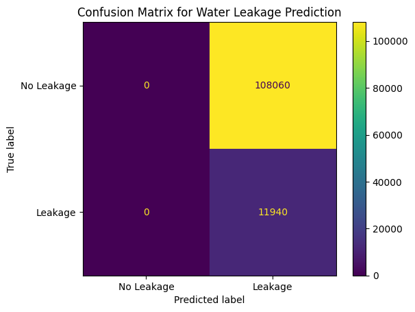

<H1> Water Supply Management </H1>

Indore faces significant challenges in its water supply and sewerage systems and has declared a water emergency. 

The reliance on water from the distant Narmada River, transported via a costly pipeline, has revealed several critical issues. These include unmetered water connections, substantial leakage from old pipelines, and unauthorized connections, leading to inefficiencies and inequitable distribution. 

The Current Municipal Corporation of Indore (IMC) lacks the technology to monitor the distribution of this water at the household level.
It includes:
1. Inability to identify and address water wastage or leakages.
2. Difficulties in ensuring equitable distribution of water.
3. Lack of data to support decision-making for maintenance and upgrades of the water supply system.

## Objectives

Our objectives for addressing these problems are:

1. **Measure and Track Water Distribution:**
   - Build a mechanism to measure and track the amount of water distributed to each household in Indore.

2. **Data Collection System:**
   - Develop a system for ongoing data collection on water usage at the household level to facilitate comprehensive analysis and reporting.

3. **Track Water Loss and Leakages:**
   - Identify and track the substantial loss of water and leakages due to old and worn-out pipelines.

4. **ML-Based Insights:**
   - Implement machine learning models to analyze the collected data and provide insights on water leakage, scarcity of water in particular areas, and other relevant issues.

## Project Components

### 1. Water Flow Sensing

Water flow sensing is crucial for accurately measuring the amount of water distributed throughout Indore. This component involves:

- **Sensor Installation:**
  - High-precision water flow sensors will be installed at strategic points in the water distribution network, including main supply lines, overhead tanks, and household connections.
  - These sensors will continuously measure the flow rate and total volume of water passing through them.

- **Data Collection:**
  - Each sensor will collect data on the volume of water flowed, the specific ID of the water tank, and the date and time of the measurement.
  - This data is essential for tracking water usage patterns and identifying any discrepancies or abnormalities in the system.

- **Integration with Existing Infrastructure:**
  - Sensors will be integrated with the existing water supply infrastructure to ensure seamless data collection without disrupting the current water distribution.

### 2. Data Transmission and Storage

Efficient data transmission and storage are vital for real-time monitoring and analysis. This component includes:

- **Data Transmission:**
  - Data collected from the sensors will be transmitted wirelessly to a central data storage system.
  - ThingSpeak, an IoT analytics platform, will be used to gather and store this data in the cloud.
  - Each data transmission will include formatted information such as integers for volume and dates for timestamping to maintain consistency and accuracy.

- **Data Formatting and Validation:**
  - The data will be validated to ensure it meets the required formats before being stored.
  - Any erroneous or incomplete data will be flagged for review to maintain the integrity of the dataset.

- **Scalability:**
  - The data transmission system will be designed to handle large volumes of data from multiple sensors across the city.
  - Scalability ensures that as more sensors are added, the system can continue to function efficiently.

### 3. Monitoring and Reporting

Monitoring and reporting are key to understanding and managing water distribution effectively. This component involves:

- **Dashboard Development:**
  - A comprehensive dashboard will be developed to visualize water distribution and usage data.
  - The dashboard will display real-time data from sensors, including current water flow rates, total water distributed, and any detected leakages.
  - Users will be able to filter data by date, location, and other parameters for detailed analysis.

- **Reporting Tools:**
  - Automated reports will be generated periodically to provide insights into water distribution efficiency, areas with high water usage, and detected issues such as leaks or unauthorized connections.
  - These reports will aid decision-makers in planning maintenance activities, addressing inefficiencies, and making informed decisions about infrastructure upgrades.

### 4. ML-Based Insights

Machine learning is a powerful tool for analyzing large datasets and uncovering patterns that are not immediately obvious. This component involves:

- **Data Analysis:**
  - Machine learning models will be developed and trained on the collected water usage data.
  - These models will analyze the data to identify patterns of water leakage, predict areas at risk of water scarcity, and detect unauthorized water usage.

- **Leakage Detection:**
  - The ML models will help identify unusual patterns in water flow that may indicate leaks.
  - By pinpointing the location and severity of leaks, maintenance teams can prioritize repairs and reduce water loss.

- **Scarcity Prediction:**
  - Predictive analytics will be used to forecast areas that are likely to experience water scarcity.
  - This allows the municipal corporation to take preemptive actions to ensure equitable water distribution and address potential shortages.

<h1>Detailed Steps Data Collection:</h1>

The water distribution system's data collection begins by identifying the wards and their respective overhead tanks, including each ward's unique LGD Code and total water requirements.

Within each ward, houses are uniquely numbered, and detailed information is gathered, including house numbers, family details, addresses, total members, and individual water requirements. 

Meter readings are regularly recorded to monitor water consumption. Pipes connected to the overhead tanks are identified by their unique IDs and dimensions, while sensors are installed at critical points to measure water flow. 

Sensor data, including water flow readings and timestamps, is collected and integrated into a central database. 

<h2>Confusion Matrix</h2>

Find the Project [Here](https://water-supply-management-3sdabtfkcdpcxq47nk97mp.streamlit.app/#household-data-for-ward-annapurna)

